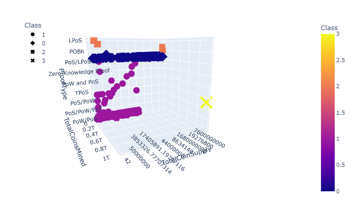

# Cryptocurrencies: using unsupervised machine learning to analyze clustering in cryptocurrencies
## Overview
Martha, the senior manager for the Advisory Services Team, would like to recommend investing in cryptocurrencies to her current employer, Accountability Accounting.  First, Martha needs to know if there is a way to break the many cryptocurrencies into subtypes, so they can recommend specific classes of currencies to different investing customers.  I have been tasked with using the KMeans type of unsupervised machine learning algorithm to discover what classes could exist and visualize the results.

## Results
### Tools
`Python 3.7` with `pandas`, `hvplot`, `plotly`, and `sklearn`

### Methods
Only currencies with at least one coin mined and which can be traded for investment purposes were included.  The data features included number of exiting coins, coins mined, algorithm, and proof type.  The total number of features was 98 once dummy vectors were made, so the dimensionality of the data was reduced using PCA.  An elbow plot was used to decide to set the number of clusters in the data to 4.  The KMeans algorithm was used to cluster the data.

### Figures
**Figure 1:** 3D plot from two orientations, showing the data plotted along the first three principle components used to classify the cryptocurrencies into 4 groups.  Classes denoted by color.  The separation between groups was almost entirely determines by PC 2 and PC3, though PC 1 separated the lone currency in class 3.

**Figure 2:** 2D plot showing how the currencies group based on the number of coins in existence and how many were mined, colored by class as determined by the KMeans clustering.  Because the colors do not group together, they overlap, this suggests that these two metrics were not major features responsible for grouping cryptocurrencies.

